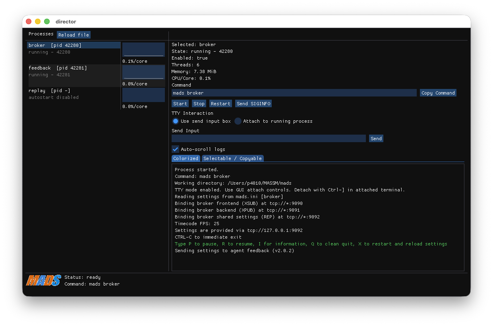

# Exercise 1: Data loading and visualization

## Prerequisites

To run this exercise, you need to have the following tools and libraries installed:

- R and RStudio from [CRAN](https://cran.r-project.org/) and Posit from [Posit](https://posit.co/download/rstudio-desktop/)
- Python 3.x
- [Docker](https://www.docker.com/get-started): install Docker Desktop for your operating system
- [MongoDB Compass](https://www.mongodb.com/products/compass): install the MongoDB GUI client
- a dump of the MongoDB example database (file `mongo_massm_2026-03-20.archive.gz`) from the GDrive shared folder (see Moodle page)

Then you need to start a [MongoDB](https://www.mongodb.com/) instance using Docker:

```bash
mkdir ~/MASSM
docker run -d -p 27017:27017 -v ${PWD}/db:/data/db --name massm-mongo mongo:latest
cat mongo_massm_2026-03-20.archive.gz | docker exec -i massm-mongo mongorestore --gzip --archive --drop
```

or, on Windows PowerShell:

```powershell
mkdir $env:USERPROFILE\MASSM
docker run -d -p 27017:27017 -v "${PWD}\db":/data/db --name massm-mongo mongo:latest
Get-Content mongo_massm_2026-03-20.archive.gz -Raw | docker exec -i massm-mongo mongorestore --gzip --archive --drop
```

Now launch MongoDB Compass and connect to `mongodb://localhost:27017`. You should see a database named `MASSM_1`.

## Database description

The `MASSM_1` database contains two *collections*, `force` and `acceleration`, containing the data acquired during a milling process from a force sensing fixture, a 3-axis accelerometer, and a microphone.

All measurements have been collected at 10kHz rate, originally spanning a total of over 5 million samples, although the force measurements have been downsampled to 200 Hz (providing mean and standard deviation in wondows of 5 ms) to reduce the data size, and the acceleration and sound pressure measurements have been kept at the original 10 kHz rate, but saved in chunks of 10 samples every 1 ms.

Each collection is made by a list of *documents*. Each document is a JSON format object containing relevant information about the acquisition.

For example, the first record in the `force` collection is:

```json
{
  "_id": {
    "$oid": "69bcfdec6d45d8c62c10ef38"
  },
  "timestamp": {
    "$date": "2026-03-20T07:57:32.407Z"
  },
  "message": {
    "agent_id": "",
    "hostname": "Fram-IV-3.local",
    "measurements": {
      "Fx": 0,
      "Fy": 0,
      "Fz": 0,
      "Mz": 0,
      "sd_Fx": 0,
      "sd_Fy": 0,
      "sd_Fz": 0,
      "sd_Mz": 0
    },
    "timestamp": {
      "$date": "2011-01-01T01:06:34.784Z"
    }
  }
}
```

Some notes on the fields:

- `_id`: the unique identifier of the document, automatically generated by MongoDB
- `timestamp`: the time when the document was inserted in the database
- `message.agent_id`: the identifier of the agent that collected the data (empty in this case)
- `message.hostname`: the hostname of the machine where the data was collected
- `message.measurements`: the actual measurements collected, including the mean and standard deviation of the force and torque components
- `message.timestamp`: the actual time when the measurements were collected

Likewise, the first record in the `acceleration` collection is:

```json
{
  "_id": {
    "$oid": "69bd07a76d45d8c62c129cc0"
  },
  "timestamp": {
    "$date": "2026-03-20T08:39:03.970Z"
  },
  "message": {
    "agent_id": "",
    "hostname": "Fram-IV-3.local",
    "measurements": {
      "Ax": [
        -0.87035,
        ... 9 more values ...
      ],
      "Ay": [
        0.35072,
        ... 9 more values ...
      ],
      "Az": [
        -1.24696,
        ... 9 more values ...
      ],
      "microphone": [
        0.20575,
        ... 9 more values ...
      ]
    },
    "timestamp": {
      "$date": "2011-01-01T01:06:34.780Z"
    }
  }
}
```

where this time the `message.measurements` field contains the 10 samples collected in the 1 ms window for each of the 3 acceleration components and for the sound pressure.

## Tasks

### Queries on MongoDB Compass

Using MongoDB Compass, perform the following queries on the `MASSM_1` database:

1. Using the query field and the query option `Project`, select 100 documents from the `force` collection starting 10 seconds after the first timestamp, and only show the `message.timestamp` and `message.measurements.Fx` fields.
2. In the **Aggregation** tab, create a pipeline to compute the mean and standard deviation of the `microphone` component for each document. Save the aggregation as a named View.

::: {.callout-tip}
Liberally use the AI assistant: learn how to give it precise and clear instructions, and ask it to write the query for you.
:::

::: {.callout-important}
Aggregations are powerful tools that can reduce computational load on database clients that consume data for analytics.

Note that with the **green save button** you can save the aggregation in the collection, so that you can run it again later, or you can **create a view**. A view is a virtual collection that is not materialized in the database, but it can be queried as a normal **read-only collection**, and it will execute the aggregation pipeline on the fly. This is useful to create custom data transformations that can be reused in different contexts.
:::

Once you have customized your data query or transformation, you can export the results as a CSV file, and then load it in R or Python for further analysis and visualization. This approach, though, **is not ideal for large datasets** (you are duplicating the data!), and it is better to use a database client library to query the database directly from your code, as we will see in the next exercises.

### Queries from R

We start loading some packages:

```{r}
#| warning: false
library(tidyverse)
library(mongolite)
library(glue)
options(digits = 15)
options(digits.secs = 3)
```

::: {.callout-warning}
If your R installation does not have the above packages, you can install them using the command `install.packages()` function.
:::

Now, using the `mongolite` library, write R code to perform the same queries as above, and load the results in a data frame. Then, create a plot of the `Fx` component over time, and a histogram of the `microphone` component.

For example, we could run:

```{r}
m <- mongo(collection = "acceleration", db = "MASSM_1", url = "mongodb://localhost:27017")
t0 <- "2011-01-01T01:07:34.780+00:00"
query <- glue(
'{{
  "message.timestamp": {{
    "$gte": {{"$date": "{t0}"}}
  }}
}}'
)
fields <- '{
  "_id": 0, 
  "message.timestamp": 1,
  "message.measurements.microphone": 1
}'
df <- m$find(query=query, fields = fields, limit=200) %>% as_tibble()
tibble(
  timestamp = df$message$timestamp,
  microphone = map_dbl(df$message$measurements$microphone, mean)
) %>% 
  ggplot(aes(x=timestamp, y=microphone)) +
  geom_line() +
  scale_x_datetime(date_labels = "%M.%OS", date_breaks = "0.05 sec")
```

::: {.callout-tip}
The query result is a rather complicate data frame, for its columns are nested lists. Try to use an aggregation of a saved View to make it simpler and more efficient to load in R.
:::

### Queries from Python

```{r}
#| echo: false
#| warning: false
library(reticulate)
py_require("pymongo")
py_require("pandas")
py_require("matplotlib")
```

Using the `pymongo` library, write Python code to perform the same queries as above, and load the results in a Pandas data frame. Then, create a plot of the `Fx` component over time, and a histogram of the `microphone` component.

For example, we could run:

```{python}
from pymongo import MongoClient
import pandas as pd
from datetime import datetime
import matplotlib.pyplot as plt
client = MongoClient("mongodb://localhost:27017")
db = client["MASSM_1"]
collection = db["acceleration"]
t0 = datetime.fromisoformat("2011-01-01T01:07:34.780+00:00")
query = {
    "message.timestamp": {
        "$gte": t0
    }
}
fields = {
    "_id": 0,
    "message.timestamp": 1,
    "message.measurements.microphone": 1
}
cursor = collection.find(query, fields).limit(100)
df = pd.DataFrame(list(cursor))
df["microphone"] = df["message"].apply(lambda x: sum(x["measurements"]["microphone"]) / len(x["measurements"]["microphone"]))
df["timestamp"] = df["message"].apply(lambda x: x["timestamp"])
plt.plot(df["timestamp"], df["microphone"])
plt.xlabel("Time")
plt.ylabel("Microphone")
plt.show()
```

::: {.callout-tip}
As said above for R, the query result is a rather complicate data frame, for its columns are nested lists. Try to use an aggregation of a saved View to make it simpler and more efficient to load in Python.
:::


# Exercise 2: data streaming via MADS

We are showing how to stream data from MongoDB to R and Python using the [MADS](https://mads-net.github.io) library.

## Install MADS

To setup the MADS framework, follow the instructions in the [MADS documentation](https://mads-net.github.io/guides/install.html). You need to install the MADS library. Beside, you need the MongoDB installed and loaded with example data as described above.

Furthermore, you need Python or R/RStudio.

## Configuring MADS

MADS is a multi-agent system for data streaming and processing. It is based on the concept of *agents* that can be configured to perform specific tasks, such as data acquisition, processing, and visualization.

MADS agents connect to a central *broker* that manages the communication between agents. Each agent can subscribe to specific *topics* to receive data, and publish data on other topics for other agents to consume.

MADS has a central configuration file, that is loaded by the broker and distributed to all agents. There is also a GUI called *director* that orchestrate the launch of the broker and the agents, and allows to monitor their status and communication.

We start by creating a configuration file for our MADS setup, `mads.ini`, and a director configuration file `director.toml`.

In your current working directory, create the file `mads.ini` with the following content:

```ini
[agents]
frontend_address = "tcp://localhost:9090"
backend_address = "tcp://localhost:9091"
settings_address = "tcp://localhost:9092"
timecode_fps = 25

[broker]
frontend_address = "tcp://*:9090"
backend_address = "tcp://*:9091"
settings_address = "tcp://*:9092"

[feedback]
sub_topic = [""]
print_width = 0
indent_width = 2

[replay]
db_uri = "mongodb://localhost:27017"
db_name = "MASSM_1"
collections = ["force", "acceleration"]
max_loop_duration_ms = 1000
repeat = true
```

Then create the file `director.toml` with the following content:

```toml
[director] 
sample_rate = 2.0 # optional, default=2.0: process metrics sampling period in seconds (fractions allowed)

[broker]
command = "mads broker"
enabled = true
relaunch = true
tty = true

[feedback]
command = "mads feedback"
after = "broker"
enabled = true

[replay]
command = "mads source replay"
after = "broker"
enabled = false
```

## Running MADS

Just launch the director with the command:

```bash
mads director
```



In the GUI that opens, you should see the broker and the feedback agent running. You can enable the replay agent to start streaming data from MongoDB by clicking on the `start` button. You should see the data being printed in the feedback agent.

::: {.callout-tip}
The director GUI is just a convenient way to launch and monitor the MADS agents. You can also launch the agents directly from the command line, using the commands specified in the `director.toml` file. For example, you can launch the broker with `mads broker`, and then launch the replay agent with `mads source replay`.
:::


## Consuming MADS data in R and Python

MADS is designed to be flexible. You can create custom agents to consume the data streamed by MADS and perform specific tasks, such as data processing, visualization, or machine learning.

Among the different strategies and languages, you can design your agents by following these strategies:

* Create a **custom C++ plugin** as [detailed here](https://mads-net.github.io/guides/plugins.html){target="_blank"}, and then use the plugin in your MADS configuration. This is the most efficient way to create custom agents, but it requires C++ programming skills.
* Use the [MADS Python agent](https://mads-net.github.io/guides/python_agent.html){target="_blank"} to create a **custom agent in Python**. Easier than the C++ plugin, does not require to define the agent logic and loop, but it is less efficient than the C++ plugin and has some limitation in flexibility.
* Use the [MADS R plugin](https://github.com/MADS-NET/r_plugin){target="_blank"} to create a **custom agent in R**. Similar as the previous case, but for R language.
* Use the [MADS Python library](https://mads-net.github.io/guides/python.html){target="_blank"} to create a **custom agent entirely in Python** that connects to the MADS broker and subscribes to the relevant topics to receive data. Very flexible, but you have to manage the agent logic and loop yourself.

::: {.callout-important}
### Real-time

Note that, unless you run the MADS agents on realtime operating systems (like RT-Linux), you cannot guarantee real-time performance, and you may experience some delay in the data streaming. However, MADS is designed to be efficient and to minimize the latency, so it can be used for near-real-time applications.
:::

## Task

Try to create a custom agent in Python or R that subscribes to the forces or accelerations data streams and performs some simple processing, such as computing the mean and standard deviation of the measurements, and then publishes the statistic back to MADS for visualization in the feedback agent.

::: {.callout-tip}
### Graphical visualization in Rerun

The [MADS rerunner](https://mads-net.github.io/guides/rerun.html){target="_blank"} is a powerful tool for visualizing data in real-time. You can use it to create custom visualizations of the data streamed by MADS, such as time series plots, ACF, FFT. It can consume data produced by any other MADS agent and provide a real-time chart or graphical representation of the data.
:::