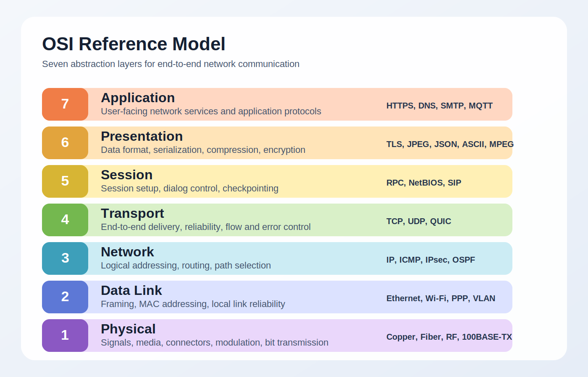

# Distributed data acquisition
How to collect and process data from multiple sensors in a manufacturing environment?

## Challenges

Acquiring multiple data from a variety of sensors and sources in a manufacturing environment poses several challenges:

- Heterogeneous data sources and formats
- Real-time processing requirements
- Large volumes of data: storage and bandwidth constraints
- Scalability and reliability
- Network- and Device-neutral architectures

## Solutions

- **Edge computing** for local processing and filtering (bandwidth reduction)
- Distributed **IIoT** data acquisition architectures (e.g., MQTT, ZeroMQ, OPC-UA)
- Cloud-based platforms for centralized **storage and analysis**
- Machine learning models for **anomaly detection** and **predictive maintenance**

# Edge Computing
*Edge* means processing data **close to the source** (i.e., at the edge of the network), rather than sending it to a centralized location (e.g., cloud) for processing

## Where to process data?

Some measurement have **high dimensionality** (e.g., vibration spectra, 2-D or 3-Dimages) or **high sampling rates** (e.g., 10 kHz), which can lead to large data volumes

Edge computing allows for **local processing** and filtering of data, reducing the bandwidth requirements for transmitting raw data over networks

This can involve techniques such as:

- feature extraction
- dimensionality reduction
- anomaly detection

at the edge, allowing only relevant information to be sent to the cloud or central servers for further analysis.


## Edge Computing - Real-time processing

Edge computing also can enable **hard real-time** processing of data (i.e. time-deterministic processing with guaranteed response times, order of 10--100 microseconds)

Such kind of processing is not trivial on general-purpose computing platforms (because of **multithreading** and other OS overheads), but can be achieved with:

- **Real-time operating systems** (e.g., FreeRTOS, RTLinux) (☠️☠️☠️)
- **Field-programmable gate arrays** (FPGAs) (☠️💰💰)
- **Application-specific integrated circuits** (ASICs) or **digital signal processors** (DSPs) (☠️☠️💰)
- bare-metal **machine control units** (MCUs)

::: callout-note
Bare-metal MCus are **microcontrollers** without OS, which are small, low-power computing devices that can be used for real-time processing of sensor data in edge computing applications. Some of those (**Arduino**) are very cheap and quick for prototyping, but they have limited processing power and memory. More powerful MCUs (e.g., **STM32, ESP32**) can handle more complex tasks and larger data volumes, but they may require more development effort and cost.
:::

# Industrial Internet of Things (IIoT)
The **Industrial Internet of Things** (IIoT) refers to the use of connected devices and sensors in industrial environments to collect and exchange data for improved efficiency, productivity, and decision-making

## IIoT Protocols

::: {.columns}
::: {.column}
Network communication happens in a layered fashion, according to the OSI model

We are mostly interested in layers 5--7 (*host layers*):

- responsible for application-level communication and data exchange
- easily customizable at the user level
:::
::: {.column}

:::
:::
<!-- end columns -->

:::callout-note
Most famous protocols (eg HTTP, FTP, SMTP) are designed for human-in-the-loop applications, are often point-to-point, and are not suitable for machine-to-machine communication, with low latency and high reliability
:::

## IIoT Protocols requirements

- **Low latency**
- **Low overhead**
- Simplified **support for complex network topologies** (e.g., publish-subscribe, peer-to-peer)
- **Scalability** and reliability
- Security features (e.g., encryption, authentication)

:::callout-important
**IoP** communication is focused on Human-to-Machine (H2M) interactions, where the mass of transmitted data is often more important than its frequency (eg a movie or a video stream), and where latency is not critical. 

In contrast, **IIoT** communication is focused on Machine-to-Machine (M2M) interactions, where low latency and high reliability are crucial, and where the volume of transmitted data per communication can be limited (eg a single scalar).
:::

## Network topologies

H2M communication almost always happens in a **point-to-point** fashion, where a client (e.g., a web browser) requests data from a server (e.g., a web server), and the server responds with the requested data.

In contrast, in M2M communication, more complex network topologies are often required, where **multiple devices** need to communicate with each other in a more flexible and scalable way. Using point-to-point communication in such scenarios can lead to scalability issues, as the number of connections grows exponentially with the number of devices, and keeping track of network addresses can become unmanageable/**error prone**

::: {.callout-tip}
Common network topologies for M2M communication include:

- **Publish-subscribe**: devices can publish data to a topic, and other devices can subscribe to that topic to receive updates; traffic is managed by a central broker that handles message distribution
- **Dealer-worker**: a device (*dealer*) can distribute messages to multiple, identical other devices (*workers*) in a round-robin fashion, with or without a central broker
:::


## Publish-subscribe architectures

::: {.columns}
::: {.column}
**Publish-Subscribe** architectures are very flexible and suitable for distributed data acquisition

Data producers (publishers) send data to **broker**, which distributes the data to interested consumers (subscribers) based on **subscriptions**: no need for direct communication between publishers and subscribers

Only the IP address or hostname of the broker needs to be known by devices: simple network management and possible dynamic addition or removal of devices (**scalability**)
:::
::: {.column}

```{mermaid}
flowchart LR
    subgraph PUB["Publishers only"]
        direction TB
        P1["device_1"]
        P2["device_2"]
    end

    subgraph BOTH["Publishers + subscribers"]
        direction TB
        B1["device_3"]
        B2["device_4"]
    end

    MB[("broker")]

    subgraph SUB["Subscribers only"]
        direction TB
        S1["device_5"]
        S2["device_6"]
    end

    style PUB fill:none,stroke:#666,stroke-width:1px
    style BOTH fill:none,stroke:#666,stroke-width:1px
    style SUB fill:none,stroke:#666,stroke-width:1px

    P1 -->|"publish: measure/sens_1"| MB
    P2 -->|"publish: measure/sens_2"| MB

    B1 -->|"publish: status/dev_3"| MB
    MB -->|"deliver: cmd/cnt_1"| B1

    B2 -->|"publish: event/dev_4"| MB
    MB -->|"deliver: cfg/dev_4"| B2

    MB -->|"deliver: measure/sens_1"| S1
    MB -->|"deliver: measure/sens_2"| S1
    MB -->|"deliver: status/dev_3"| S2
    MB -->|"deliver: event/dev_4"| S2
```

:::
:::
<!-- end columns -->

## Commonly used IIoT protocols

The most commonly used IIoT protocols include:

* **MQTT** (*Message Queuing Telemetry Transport*): a lightweight publish-subscribe protocol designed for low-bandwidth, high-latency, or unreliable networks; widely used in IIoT applications for its simplicity and efficiency ([simple]{.bgreen}, [limited architectures]{.bred})
* **ZeroMQ** (*Zero Message Queue*): a high-performance asynchronous messaging library that provides a simple and flexible API for building distributed applications; supports various messaging patterns, including publish-subscribe, request-reply, and dealer-worker; often used in IIoT applications for its scalability and low latency (**very flexible**)
* **OPC-UA** (*Open Platform Communications, Unified Architecture*): a platform-independent, service-oriented architecture for industrial automation; provides a standardized way to access and exchange data between devices and systems in industrial environments; supports both client-server and publish-subscribe communication models ([industrial-grade]{.bgreen}, [complex]{.bred})


# Storage and analysis
Data produced on the edge and transported by the network need to be **stored** and **analyzed** for further insights and decision-making

## Storage
A plant can produce a staggering amount of data, which can be difficult to manage and analyze without proper storage strategies

- **Cloud storage**: scalable and flexible, but can have latency and security concerns
- **On-premises storage**: more control and security, but can be costly and less scalable
- **Hybrid storage**: combines the benefits of both cloud and on-premises storage, allowing for a more flexible and cost-effective solution

::: {.callout-important}
Regardless of *where* data is stored, there are different storeage *models* to consider:

- **Data lakes**: store raw, unstructured data in its native format, allowing for flexibility and scalability; can be more difficult to manage and analyze due to lack of structure
- **Data warehouses**: store structured data in a predefined schema, optimized for querying and analysis; can be less flexible and scalable than data lakes
- **Data marts**: store a subset of data from a data warehouse, focused on a specific business area or function; can provide faster access to relevant data, but can lead to data silos and inconsistencies
:::

## Data lakes
Data lakes are designed to store raw, unstructured data in its native format. They can handle a wide variety of data types, including structured, semi-structured, and unstructured data

**Shape** of data can be freely changed, which leads to flexibility and scalability, but can make data management and analysis more difficult due to lack of structure

Commonly used technologies for data lakes include:

- **Hadoop Distributed File System** (HDFS): a distributed file system that provides scalable and fault-tolerant storage for large volumes of data; often used in conjunction with the Hadoop ecosystem for big data processing
- **Amazon S3**: a cloud-based object storage service that provides scalable and durable storage
- **Azure Data Lake Storage**: a cloud-based data lake service that provides scalable and secure storage for big data analytics
- **MongoDB**: a NoSQL database that can be used as a data lake for storing unstructured data; provides flexibility, scalability, and can run on-premises, but may not be optimized for large-scale analytics. It stores data as collections of JSON documents

## Data warehouses
Data warehouses are designed to store structured data in a predefined schema, optimized for querying and analysis

This often relies on a **relational database management system** (RDBMS), which organizes data into tables with rows and columns, and allows for complex queries using SQL

Wrt data lakes, data warehouses can provide faster access to relevant data for analysis, but can be less flexible and scalable due to the need for predefined schemas and the overhead of managing structured data

As such, RDBMS-based data warehouses are often used for mature, well-defined data that is used for reporting and analysis, while data lakes are often used for raw, unstructured data that may require more exploration and processing before analysis

## Analysis
Some preliminary analysis and data manipulation can be performed on the data lake or data warehouse. 

For example, MongoDB provides a powerful query language and aggregation (*map-reduce* actions) framework that can be used for data analysis and transformation (**pipelines**), allowing for some level of analysis to be performed directly on the data lake, without the need for a separate data warehouse

MongoDB *pipelines* can be set as read-only virtual tables, or **views**, that can be queried like regular tables, but the underlying data is not duplicated, and the view is updated in real-time as the underlying data changes

## Machine learning for anomaly detection and predictive maintenance
**Machine learning models** can be trained on the data stored in the data lake or data warehouse to later perform tasks such as anomaly detection and predictive maintenance, in real-time

Machine learning models can be **supervised** or **unsupervised**, can be implemented with conventional algorithms (e.g., SVM, PCA) or deep learning architectures (e.g., CNNs, RNNs), and can be deployed on the edge or in the cloud, depending on the requirements of the application