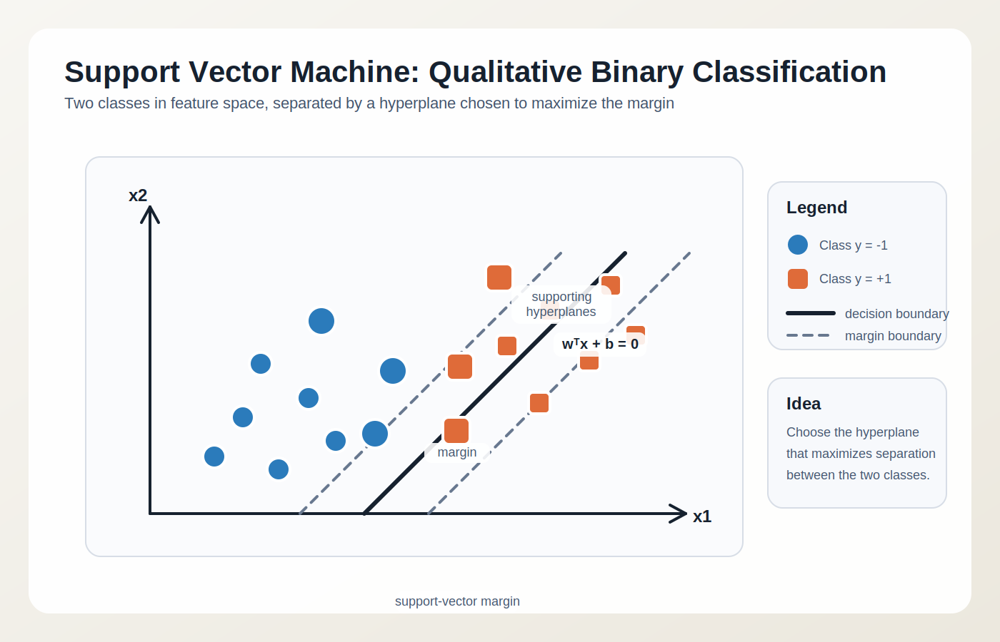
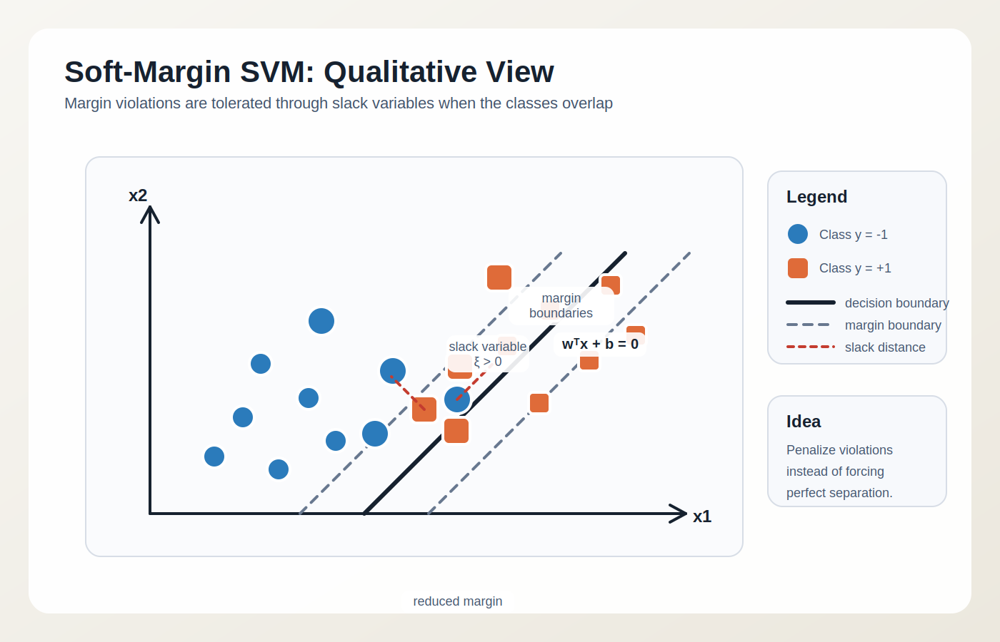

```{r setup}
options(width = 60)
set.seed(0)
library(latex2exp)
library(tidyverse)
library(ggfortify)
library(patchwork)
library(e1071)
theme_set(theme_gray() + theme(legend.position = "bottom"))

n <- 240
t <- 1:n
fault_idx <- 151:210

x1 <- cumsum(rnorm(n, 0, 0.06)) + 0.7 * sin(2 * pi * t / 24)
x2 <- 0.8 * x1 + rnorm(n, 0, 0.18)
x1[fault_idx] <- x1[fault_idx] + 1.0
x2[fault_idx] <- -0.2 * x1[fault_idx] + rnorm(length(fault_idx), 0, 0.22) + 0.7

ts_df <- tibble(
  t = t,
  x1 = x1,
  x2 = x2,
  state = factor(if_else(t %in% fault_idx, "Fault", "Normal"))
)

pca_fit <- prcomp(ts_df %>% select(x1, x2), center = TRUE, scale. = TRUE)
scores <- as_tibble(pca_fit$x) %>%
  mutate(t = ts_df$t, state = ts_df$state)

lambda <- pca_fit$sdev^2
center_vec <- pca_fit$center
scale_vec <- pca_fit$scale
x_scaled <- scale(ts_df %>% select(x1, x2), center = center_vec, scale = scale_vec)
x_hat <- tcrossprod(pca_fit$x[, 1, drop = FALSE], pca_fit$rotation[, 1, drop = FALSE])
residuals_mat <- x_scaled - x_hat
spe <- rowSums(residuals_mat^2)
t2 <- rowSums((pca_fit$x[, 1:2, drop = FALSE]^2) / matrix(rep(lambda[1:2], each = n), ncol = 2))
alpha_t2 <- 0.05
a_t2 <- 2
n_ref <- sum(ts_df$state == "Normal")
t2_limit <- a_t2 * (n_ref - 1) / (n_ref - a_t2) *
  qf(1 - alpha_t2, df1 = a_t2, df2 = n_ref - a_t2)

ts_pca <- ts_df %>%
  mutate(PC1 = pca_fit$x[, 1],
         PC2 = pca_fit$x[, 2],
         SPE = spe,
         T2 = t2,
         T2_limit = t2_limit)
```

# Feature-based time-series analysis

In feature-based analysis, a multivariate time series in $p$ dimensions is transformed into a sequence of vectors
$$
\mathbf{x}_t \in \mathbb{R}^p,\quad t = 1,\dots,N
$$
where each component is either a direct measurement or an extracted descriptor such as RMS, variance, spectral energy, kurtosis, or temperature gradient

The objective is to **project, compress, classify**, or separate process states in the feature space rather than directly on the raw waveform

Two standard techniques are:

* **PCA**, mainly for dimensionality reduction, monitoring, and latent-structure analysis
* **SVM**, mainly for supervised classification and margin-based separation

# PCA theory

## PCA: data matrix and centering
::: {.columns}
::: {.column}
Let the **feature matrix** of a MVTS be
$$
\mathbf{X} =
\begin{bmatrix}
\mathbf{x}_1^T \\
\mathbf{x}_2^T \\
\vdots \\
\mathbf{x}_N^T
\end{bmatrix}
\in \mathbb{R}^{N \times p}
$$
where each row is a **feature vector** extracted at one time instant or from one time window statistics
:::
::: {.column}
PCA starts from the centered matrix $\mathbf{X}_c$:
$$
\mathbf{X}_c = \mathbf{X} - \boldsymbol{\mu}^T
$$
with sample means vector:
$$
\boldsymbol{\mu} = \frac{1}{N}\sum_{t=1}^{N}\mathbf{x}_t
$$

If variables have different physical units, one usually **standardizes** them before PCA
:::
:::
<!-- end columns -->

## PCA: covariance matrix and eigenproblem

::: {.columns}
::: {.column}
The sample covariance matrix ($p\times p$)is:
$$
\mathbf{S} = \frac{1}{N-1}\mathbf{X}_c^T \mathbf{X}_c
$$

PCA solves the eigenvalue problem:
$$
\mathbf{S}\mathbf{p}_i = \lambda_i \mathbf{p}_i,
\quad i = 1,\dots,p
$$

:::
::: {.column}

where:

* $\lambda_i$ is the variance explained by the $i$-th principal component
* $\mathbf{p}_i$ is the corresponding eigenvector, or **loading vector**

The indexes $i$ are sorted so that:
$$
\lambda_1 \ge \lambda_2 \ge \dots \ge \lambda_p \ge 0
$$

:::
:::
<!-- end columns -->

::: {.callout-note}
The eigenvectors $\mathbf{p}_i$ are orthogonal and form a new coordinate system in feature space, where the first axis captures the largest variance, the second axis captures the largest remaining variance, and so on.
:::


## PCA: scores and low-dimensional representation

::: {.columns}
::: {.column}
The projection of the data onto the principal axes gives the **scores matrix** ($N\times p$):
$$
\mathbf{T} = \mathbf{X}_c \mathbf{P}
$$
where:
$$
\mathbf{P} = [\mathbf{p}_1,\mathbf{p}_2,\dots,\mathbf{p}_p]
$$

:::
::: {.column}
Using only the first $a < p$ components yields the reduced model
$$
\mathbf{X}_c \approx \mathbf{T}_a \mathbf{P}_a^T
$$
where:
$$
\mathbf{T}_a = \mathbf{X}_c \mathbf{P}_a
$$
:::
:::
<!-- end columns -->

::: {.callout-note}
For a given subset of principal components $a$, the **explained variance ratio** is:
$\eta_a = \frac{\sum_{i=1}^{a}\lambda_i}{\sum_{i=1}^{p}\lambda_i}$. This can be used to select the number of components to retain, for example by setting a threshold such as $\eta_a \ge 0.95$.
:::

:::aside
**Note**: We can use transpose rather than inverse because $\mathbf{P}$ is an orthonormal matrix, so $\mathbf{P}^{-1} = \mathbf{P}^T$.
:::

## PCA: reconstruction error and monitoring statistics

::: {.columns}
::: {.column}
For one centered observation vector $\mathbf{x}_{c,t}$, PCA first computes the score vector
$$
\mathbf{t}_t = \mathbf{P}_a^T \mathbf{x}_{c,t}
$$
and then reconstructs it in feature space as
$$
\hat{\mathbf{x}}_{c,t} = \mathbf{P}_a \mathbf{t}_t
$$

Therefore the residual decomposition is:
$$
\mathbf{x}_{c,t} = \hat{\mathbf{x}}_{c,t} + \mathbf{\varepsilon}_t
$$
where $\hat{\mathbf{x}}_{c,t}$ lies in the retained **latent subspace** and $\mathbf{\varepsilon}_t$ is the residual vector
:::
::: {.column}

Two standard **monitoring statistics** are:

* Hotelling's $T^2$ [](#hotellings-t2-distribution):
$$
T_t^2 = \sum_{i=1}^{a}\frac{t_{ti}^2}{\lambda_i}
$$

* Squared Prediction Error, SPE or $Q$ statistic:
$$
Q_t = \|\mathbf{\varepsilon}_t\|_2^2
    = \sum_{j=1}^{p}\varepsilon_{tj}^2
$$
:::
:::
<!-- end columns -->

::: {.callout-note}
$T^2$ measures abnormality inside the retained subspace, while $Q_t$ measures lack of fit outside it
:::


## PCA: why it is useful for time series

PCA is applied to time-series analysis after building features from samples or windows

Typical uses are:

* reducing a multivariate signal to a few **latent variables**
* detecting operating regimes and structural changes
* decorrelating strongly coupled measurements
* identifying dominant directions of variability

::: {.callout-important}
For dynamic systems, PCA by itself does not describe how the system evolves over time. It only summarizes the data in feature space; any temporal information must be introduced explicitly, for example through window-based features or lagged variables, that is, past values of the same signal such as $x_{t-1}$, $x_{t-2}$, and so on, used together with the current value $x_t$ to capture the temporal dynamics
:::

# SVM theory

## SVM: supervised binary classification

::: {.columns}
::: {.column}
Assume **labeled feature vectors**, where $\mathbf{x_i}$ is the vector of observations and $y_i$ is the class label:
$$
(\mathbf{x}_i, y_i),\quad y_i \in \{-1,+1\},\quad i=1,\dots,N
$$

The goal is to learn a decision function
$$
f(\mathbf{x}) = \mathrm{sign}(g(\mathbf{x}))
$$
that separates the two classes with maximum robustness

For the linear case, $g(\mathbf{x}) = \mathbf{w}^T \mathbf{x} + b$ 
and the separating boundary is the hyperplane $\mathbf{w}^T \mathbf{x} + b = 0$
:::
::: {.column}

:::
:::
<!-- end columns -->

## SVM: maximum-margin principle

If the classes are linearly separable, the hard-margin SVM solves:
$$
\min_{\mathbf{w},b}\frac{1}{2}\|\mathbf{w}\|_2^2
$$
subject to
$$
y_i(\mathbf{w}^T\mathbf{x}_i+b)\ge1,\quad i=1,\dots,N
$$

The geometric margin is
$$
\gamma = \frac{2}{\|\mathbf{w}\|_2}
$$

Therefore, minimizing $\|\mathbf{w}\|_2^2$ is equivalent to maximizing the separation margin

## SVM: Interactive Example

::: {.columns}
::: {.column}
* We select as decision boundary $\mathbf{w} = [\cos(\theta), \sin(\theta)]^T$ 
* $||\mathbf w||_2 = 1$ (it is a **unit vector**) 
* $b$ the intercept with the vertical axis 

The margin width is then $2/\|\mathbf{w}\|_2 = 2$ and the support vectors are those that satisfy $y_i(\mathbf{w}^T\mathbf{x}_i+b) = 1$

Try and find $\theta, b$ that **maximize the margin** while correctly classifying all points

::: {.callout-caution}
With the hard margin formulation, there is no solution if the data are not linearly separable, which is often the case in real applications. This motivates the introduction of the soft margin formulation, which allows for some misclassifications while still maximizing the margin.
:::


:::
::: {.column}
<iframe scrolling="no" title="taglio ortogonale" src="https://www.geogebra.org/material/iframe/id/rdtebds9/width/600/height/500/border/ffffff/sfsb/true/smb/false/stb/false/stbh/false/ai/false/asb/false/sri/false/rc/false/ld/false/sdz/false/ctl/false" width="600px" height="500px" style="border:1px solid black; margin-bottom: -20px;">

</iframe>
:::
:::
<!-- end columns -->

## SVM: Interactive Example (R version)

```{r}
df <-  tibble(
  x1 = c(-3, -2, -2, -1, 2, 3, 2, 1),
  x2 = c(1, 2, -1, 1, 1, 2, -1, 0),
  state = factor(c("B", "B", "B", "B", "A", "A", "A", "A"))
)
```

::: {.columns}
::: {.column}

We do a **linear SVM** classification and add predictions to it:
```{r}
#| echo=TRUE
fit <- svm(
  state ~ x1 + x2, data = df, 
  scale = FALSE, kernel = "linear"
)

df <-  df %>% mutate(
  id = 1:n(),
  pred = predict(fit, .),
  sv = if_else(id %in% fit$index, "SV", "Other")
)
coef(fit)
```

Coefficients are $b$, $w_1$, and $w_2$ in the decision function $g(\mathbf{x}) = w_1 x_1 + w_2 x_2 + b$
:::
::: {.column}

```{r}
grid <- expand.grid(
  x1 = seq(min(df$x1) - 0.3, max(df$x1) + 0.3, length.out = 160),
  x2 = seq(min(df$x2) - 0.3, max(df$x2) + 0.3, length.out = 160)
)
grid$pred <- predict(fit, grid)
cf <- coef(fit)
df %>% ggplot(aes(x = x1, y = x2)) +
  geom_point(aes(color = state, shape = sv), size = 3) +
  geom_abline(intercept = -cf[1]/cf[3], slope = -cf[2]/cf[3], color = "black") +
  geom_tile(data = grid, aes(x = x1, y = x2, fill = pred), alpha = 0.25) +
  labs(x = "x1", y = "x2", title = "SVM example dataset")
```
:::
:::
<!-- end columns -->

## SVM: soft margin and hinge loss

::: {.columns}
::: {.column}
Real process data are noisy, overlapping, and rarely perfectly separable

The soft-margin formulation introduces **slack variables** $\xi_i \ge 0$:
$$
\min_{\mathbf{w},b,\boldsymbol{\xi}}
\frac{1}{2}\|\mathbf{w}\|_2^2 + C\sum_{i=1}^{N}\xi_i
$$
subject to:
$$
y_i(\mathbf{w}^T\mathbf{x}_i+b)\ge1-\xi_i
$$
:::
::: {.column}

:::
:::
<!-- end columns -->

The parameter $C$ balances margin width against classification violations

::: {.callout-note}
Equivalent empirical-risk view: $\min_{\mathbf{w},b}\frac{1}{2}\|\mathbf{w}\|_2^2 + C\sum_{i=1}^{N}\max(0,1-y_i(\mathbf{w}^T\mathbf{x}_i+b))$
:::


## Equivalent empirical-risk view

::: {.columns}
::: {.column}
The same soft-margin SVM can be written as
$$
\min_{\mathbf{w},b}\frac{1}{2}\|\mathbf{w}\|_2^2 +
C\sum_{i=1}^{N}\max(0,1-y_i(\mathbf{w}^T\mathbf{x}_i+b))
$$

This has the standard machine-learning form
$$
\text{regularization} + \text{empirical loss}
$$

* $\frac{1}{2}\|\mathbf{w}\|_2^2$ penalizes complex models and favors a wider margin
* $\max(0,1-y_i(\mathbf{w}^T\mathbf{x}_i+b))$ is the **hinge loss**
* $C$ controls the trade-off between margin size and training violations
:::
::: {.column}
Interpretation:

* if $y_i(\mathbf{w}^T\mathbf{x}_i+b)\ge1$, the point is correctly classified and outside the margin, so the loss is 0
* if $0<y_i(\mathbf{w}^T\mathbf{x}_i+b)<1$, the point is correctly classified but inside the margin
* if $y_i(\mathbf{w}^T\mathbf{x}_i+b)\le0$, the point is misclassified

So this view is **equivalent** to the slack-variable formulation:

* geometric view: maximize margin while allowing violations
* empirical-risk view: minimize regularized hinge loss on the training set
:::
:::
<!-- end columns -->


## SVM: dual problem and kernel trick

::: {.columns}
::: {.column}

The dual formulation is
$$
\max_{\boldsymbol{\alpha}}
\sum_{i=1}^{N}\alpha_i -
\frac{1}{2}\sum_{i=1}^{N}\sum_{j=1}^{N}
\alpha_i\alpha_j y_i y_j K(\mathbf{x}_i,\mathbf{x}_j)
$$
with constraints
$$
\alpha_i \ge 0,\qquad
\sum_{i=1}^{N}\alpha_i y_i = 0
$$

:::
::: {.column}

The kernel function
$$
K(\mathbf{x}_i,\mathbf{x}_j)=\phi(\mathbf{x}_i)^T\phi(\mathbf{x}_j)
$$
allows nonlinear separation in the original space through linear separation in a transformed feature space

Common kernels:

* linear: $K(\mathbf{x},\mathbf{z})=\mathbf{x}^T\mathbf{z}$
* polynomial
* radial basis function, RBF:
$$
K(\mathbf{x},\mathbf{z})=\exp(-\gamma\|\mathbf{x}-\mathbf{z}\|_2^2)
$$

:::
:::
<!-- end columns -->

## SVM: decision function and time-series use

After training, the decision function is
$$
g(\mathbf{x}) = \sum_{i \in SV}\alpha_i y_i K(\mathbf{x}_i,\mathbf{x}) + b
$$
where only the **support vectors** contribute

For time-series analysis, SVM is applied to features extracted from samples or windows, for example:

* direct multivariate measurements $(x_{1,t},x_{2,t},\dots)$
* lagged vectors $(x_t,x_{t-1},\dots,x_{t-L})$
* statistical and spectral features over a window

SVM is therefore a classification rule in feature space, not a stochastic time model

# PCA example in R

## Synthetic bivariate time series

:::columns
:::column
We construct a bivariate time series with two process variables:

* a **normal** regime with strong positive correlation
* a **fault** regime with mean shift and changed covariance structure

This is enough to illustrate how PCA detects changes in latent structure
:::

:::column
```{r}
p1 <- ggplot(ts_df, aes(x = t, y = x1)) +
  geom_line(aes(color="Normal")) +
  geom_line(aes(color="Fault"), data = filter(ts_df, state == "Fault"), linewidth = 1) +
  labs(x = "Time index", y = "x1")

p2 <- ggplot(ts_df, aes(x = t, y = x2)) +
  geom_line(aes(color="Normal")) +
  geom_line(aes(color="Fault"), data = filter(ts_df, state == "Fault"), linewidth = 1) +
  labs(x = "Time index", y = "x2")

p1 / p2
```
:::
:::

## PCA on the bivariate series

:::columns
:::column
We apply PCA to the standardized two-variable feature matrix

Since $p=2$, the model is simple enough to visualize directly:

* **loadings** describe the principal directions
* **scores** show how observations evolve in the latent space
* **explained variance** quantifies dimensional compression

::: {.callout-note}
This is called a **biplot**. Another useful visualization is the **screeplot**, which shows the explained variance ratio $\eta_a$ as a function of the number of retained components $a$.
:::

:::

:::column
```{r}
summary(pca_fit)
round(pca_fit$rotation, 3)
```

```{r}
autoplot(pca_fit, data = ts_df, colour = "state",
         loadings = TRUE, loadings.label = TRUE,
         loadings.label.size = 3) +
  labs(title = "PCA score plot with loadings") +
  coord_fixed() +
  coord_flip()
```
:::
:::

## PCA monitoring statistics

:::columns
:::column
For each time instant we compute:

* score coordinates PC1 and PC2
* SPE, squared prediction error
* Hotelling's $T^2$

For $T^2$ we can define a control limit associated with a false-alarm probability $\alpha$:
$$
T^2_{\alpha} =
\frac{a(n-1)}{n-a}F_{a,n-a;1-\alpha}
$$
where $a$ is the number of retained components and $n$ is the reference sample size

:::

:::column
```{r}
p1 <- ggplot(ts_pca, aes(x = t)) +
  geom_line(aes(y = PC1, color = "Normal")) +
  geom_line(aes(y = PC2, color = "Normal"), alpha = 0.5) +
  geom_line(aes(y = PC1, color = "Fault"), data = filter(ts_pca, state == "Fault"), linewidth = 1) +
  geom_line(aes(y = PC2, color = "Fault"), data = filter(ts_pca, state == "Fault"), linewidth = 1, alpha = 0.5) +
  labs(x = "Time index", y = "PC1/PC2") + 
  theme(legend.position = "none")

p2 <- ggplot(ts_pca, aes(x = t, y = SPE)) +
  geom_line(aes(color = "Normal")) +
  geom_line(aes(color = "Fault"), data = filter(ts_pca, state == "Fault"), linewidth = 1) +
  labs(x = "Time index", y = "SPE") +
  theme(legend.position = "none")

p3 <- ggplot(ts_pca, aes(x = t, y = T2)) +
  geom_line(aes(color = "Normal")) +
  geom_line(aes(color = "Fault"), data = filter(ts_pca, state == "Fault"), linewidth = 1) +
  geom_hline(yintercept = t2_limit, color = "blue", linetype = 2) +
  labs(x = "Time index", y = TeX("$T^2$"))

p1 / p2 / p3
```
:::
:::

:::aside
In this synthetic example, PCA is mainly used as an exploratory and monitoring tool: it reveals the regime change without using class labels during training.
:::

# SVM example in R

```{r}
svm_fit <- svm(state ~ x1 + x2, data = ts_df,
               kernel = "radial", cost = 5, gamma = 1,
               scale = TRUE)
ts_df$pred <- predict(svm_fit, ts_df)
acc <- mean(ts_df$pred == ts_df$state)

grid <- expand.grid(
  x1 = seq(min(ts_df$x1) - 0.3, max(ts_df$x1) + 0.3, length.out = 160),
  x2 = seq(min(ts_df$x2) - 0.3, max(ts_df$x2) + 0.3, length.out = 160)
)
grid$pred <- predict(svm_fit, grid)
```

## SVM on the same bivariate time series

:::columns
:::column
Now we use the same observations, but with labels `Normal` and `Fault`

The feature vector is simply
$$
\mathbf{x}_t = [x_{1,t},x_{2,t}]^T
$$

An RBF-kernel SVM is trained to separate the two states
:::

:::column
```{r}
svm_fit
acc
```

```{r}
ggplot() +
  geom_tile(data = grid,
            aes(x = x1, y = x2, fill = pred),
            alpha = 0.25) +
  geom_point(data = ts_df,
             aes(x = x1, y = x2, color = state),
             size = 1.8) +
  labs(x = "x1", y = "x2",
       title = "SVM decision regions on the feature space")
```
:::
:::

## SVM predicted labels over time

:::columns
:::column
The decision boundary is learned in feature space, but the output can be mapped back to time

This makes it possible to compare:

* true process state
* SVM predicted state
* classification errors and transition regions
:::

:::column
```{r}
ggplot(ts_df, aes(x = t)) +
  geom_line(aes(y = as.numeric(state), color = "True"), linewidth = 1) +
  geom_line(aes(y = as.numeric(pred), color = "Predicted"),
            linewidth = 0.9, linetype = 2) +
  scale_y_continuous(breaks = c(1, 2),
                     labels = levels(ts_df$state)) +
  labs(x = "Time index", y = "Class",
       color = "", title = "True and predicted labels")
```
:::
:::

## Python example: same synthetic dataset

The same bivariate time series can be generated in Python with `numpy` and stored in a `pandas` data frame

```python
import numpy as np
import pandas as pd

np.random.seed(0)

n = 240
t = np.arange(1, n + 1)
fault_idx = np.arange(150, 210)

x1 = np.cumsum(np.random.normal(0, 0.06, n)) \
     + 0.7 * np.sin(2 * np.pi * t / 24)
x2 = 0.8 * x1 + np.random.normal(0, 0.18, n)

x1[fault_idx] = x1[fault_idx] + 1.0
x2[fault_idx] = -0.2 * x1[fault_idx] \
                + np.random.normal(0, 0.22, len(fault_idx)) + 0.7

state = np.where(np.isin(t, fault_idx + 1), "Fault", "Normal")

df = pd.DataFrame({
    "t": t,
    "x1": x1,
    "x2": x2,
    "state": state
})
```

# PCA example in Python

## PCA on the bivariate series in Python

:::columns
:::column
The PCA workflow in Python is analogous to the R one:

* standardize the variables
* fit a PCA model
* inspect explained variance and loadings
* project the observations to obtain principal scores
:::

:::column
```python
from sklearn.preprocessing import StandardScaler
from sklearn.decomposition import PCA

X = df[["x1", "x2"]].to_numpy()

scaler = StandardScaler()
X_scaled = scaler.fit_transform(X)

pca = PCA(n_components=2)
scores = pca.fit_transform(X_scaled)

df["PC1"] = scores[:, 0]
df["PC2"] = scores[:, 1]

print(pca.explained_variance_ratio_)
print(pca.components_)
```
:::
:::

## PCA monitoring statistics in Python

:::columns
:::column
As in R, we can reconstruct the retained subspace and compute:

* the score trajectories
* Hotelling's $T^2$
* the residual SPE statistic

This provides a direct parallel with the PCA monitoring slide shown earlier
:::

:::column
```python
import numpy as np

lam = pca.explained_variance_
X_hat = scores @ pca.components_
E = X_scaled - X_hat

df["SPE"] = np.sum(E**2, axis=1)
df["T2"] = np.sum((scores**2) / lam, axis=1)
```

```python
import matplotlib.pyplot as plt

fig, ax = plt.subplots(2, 1, figsize=(8, 5), sharex=True)
ax[0].plot(df["t"], df["PC1"])
ax[0].set_ylabel("PC1")
ax[1].plot(df["t"], df["SPE"])
ax[1].set_ylabel("SPE")
ax[1].set_xlabel("Time index")
```
:::
:::

# SVM example in Python

## SVM on the same bivariate time series in Python

:::columns
:::column
Using `scikit-learn`, the same classification problem is solved by fitting an RBF-kernel SVM to the two features

The workflow is:

* build `X` and class labels `y`
* fit `SVC`
* predict the class of each observation
* evaluate accuracy and inspect the decision regions
:::

:::column
```python
from sklearn.svm import SVC
from sklearn.metrics import accuracy_score

X = df[["x1", "x2"]].to_numpy()
y = df["state"].to_numpy()

svc = SVC(kernel="rbf", C=5.0, gamma=1.0)
svc.fit(X, y)

df["pred"] = svc.predict(X)
acc = accuracy_score(y, df["pred"])
print(acc)
```
:::
:::

## SVM decision regions and predicted labels in Python

:::columns
:::column
The decision map in feature space can be visualized by evaluating the classifier on a regular grid

The predicted labels can then be plotted back against time exactly as done in the R example
:::

:::column
```python
x1g = np.linspace(df["x1"].min() - 0.3, df["x1"].max() + 0.3, 160)
x2g = np.linspace(df["x2"].min() - 0.3, df["x2"].max() + 0.3, 160)
xx1, xx2 = np.meshgrid(x1g, x2g)
Xg = np.column_stack([xx1.ravel(), xx2.ravel()])
zg = svc.predict(Xg).reshape(xx1.shape)
```

```python
fig, ax = plt.subplots(1, 2, figsize=(10, 4))
ax[0].contourf(xx1, xx2, (zg == "Fault").astype(float), alpha=0.25)
ax[0].scatter(df["x1"], df["x2"], c=(df["state"] == "Fault"))
ax[0].set_xlabel("x1")
ax[0].set_ylabel("x2")

ax[1].plot(df["t"], df["state"].eq("Fault").astype(int), label="True")
ax[1].plot(df["t"], df["pred"].eq("Fault").astype(int), "--",
           label="Predicted")
ax[1].set_xlabel("Time index")
ax[1].legend()
```
:::
:::

## PCA and SVM: complementary roles

PCA and SVM serve different purposes:

* PCA is **unsupervised** and looks for directions of maximum variance
* SVM is **supervised** and looks for a boundary that best separates known classes

In practice they are often combined:

* PCA for denoising or dimensionality reduction
* SVM for classification on the retained principal scores

For high-dimensional time-series features this PCA plus SVM pipeline is often more stable than direct classification on raw variables alone


# Complementary resources

## Hotelling's $T^2$ distribution

Hotelling's $T^2$ is the multivariate extension of Student's $t$ test when the parameter of interest is a **mean vector** rather than a scalar mean

If
$$
\mathbf{x}_1,\dots,\mathbf{x}_n \in \mathbb{R}^p
$$
are independent observations from a multivariate normal population, the one-sample null hypothesis is
$$
H_0:\boldsymbol{\mu}=\boldsymbol{\mu}_0
$$

The sample mean vector and covariance matrix are
$$
\bar{\mathbf{x}}=\frac{1}{n}\sum_{i=1}^{n}\mathbf{x}_i,
\qquad
\mathbf{S}=\frac{1}{n-1}\sum_{i=1}^{n}
(\mathbf{x}_i-\bar{\mathbf{x}})
(\mathbf{x}_i-\bar{\mathbf{x}})^T
$$

## One-sample Hotelling's $T^2$

The test statistic is
$$
T^2 = n(\bar{\mathbf{x}}-\boldsymbol{\mu}_0)^T
\mathbf{S}^{-1}
(\bar{\mathbf{x}}-\boldsymbol{\mu}_0)
$$

Interpretation:

* $(\bar{\mathbf{x}}-\boldsymbol{\mu}_0)$ is the deviation from the target mean vector
* $\mathbf{S}^{-1}$ scales that deviation by the covariance structure
* large values of $T^2$ indicate that the observed mean is too far from the target to be explained by normal variability

For $p=1$, this reduces to the usual Student's $t^2$

## Relation with the F distribution

Under multivariate normality and under $H_0$, the statistic can be converted into an F test:
$$
F = \frac{n-p}{p(n-1)}T^2
$$
with
$$
F \sim F_{p,n-p}
$$

Therefore, at significance level $\alpha$, we reject $H_0$ when
$$
T^2 >
\frac{p(n-1)}{n-p}F_{p,n-p;1-\alpha}
$$

This gives an exact critical region for the one-sample test

## Two-sample Hotelling's $T^2$

If two independent populations are compared,
$$
H_0:\boldsymbol{\mu}_1=\boldsymbol{\mu}_2
$$
the pooled-covariance version of the statistic is
$$
T^2 =
\frac{n_1 n_2}{n_1+n_2}
(\bar{\mathbf{x}}_1-\bar{\mathbf{x}}_2)^T
\mathbf{S}_p^{-1}
(\bar{\mathbf{x}}_1-\bar{\mathbf{x}}_2)
$$
where
$$
\mathbf{S}_p =
\frac{(n_1-1)\mathbf{S}_1 + (n_2-1)\mathbf{S}_2}
{n_1+n_2-2}
$$

This is the multivariate analogue of the classical two-sample t test

## Assumptions and interpretation

Hotelling's $T^2$ is appropriate when:

* observations are independent
* the population is approximately multivariate normal
* the covariance matrix is nonsingular

Its main advantage over multiple univariate t tests is that it tests the mean vector **jointly**, accounting for correlation between variables

This avoids contradictory conclusions caused by ignoring covariance structure

## Example: quality-control test on a batch

Consider a batch of machined parts. For each part we measure two variables:

* `length`
* `weight`

The design target is the mean vector
$$
\boldsymbol{\mu}_0 =
\begin{bmatrix}
50.0 \\
100.0
\end{bmatrix}
$$

We want to test whether the batch mean is statistically compatible with this target, using a **multivariate one-sample test**

## Example: data cloud and target point

```{r}
# Hotelling's T^2 test for the batch data
batch_n <- 40
mu0 <- c(50.0, 100.0)
Sigma_batch <- matrix(c(1.0, 0.7,
                        0.7, 1.6), nrow = 2, byrow = TRUE)
z_batch <- matrix(rnorm(2 * batch_n), ncol = 2)
batch_x <- sweep(z_batch %*% chol(Sigma_batch), 2,
                 c(50.55, 100.95), "+")

batch_df <- tibble(
  length = batch_x[, 1],
  weight = batch_x[, 2]
)
xbar_batch <- colMeans(batch_x)
```

:::columns
:::column
This is **not** a time series problem:

* each point is one manufactured part
* the two measured variables are correlated
* the question concerns the joint mean of the batch

The red point is the target mean $\boldsymbol{\mu}_0$, while the blue point is the sample mean
:::

:::column

:::panel-tabset
## Plot
```{r}
ggplot(batch_df, aes(x = length, y = weight)) +
  geom_point(color = gray(0.45), alpha = 0.8) +
  geom_point(aes(x = mu0[1], y = mu0[2]),
             color = "red", size = 3) +
  geom_point(aes(x = xbar_batch[1], y = xbar_batch[2]),
             color = "blue", size = 3) +
  labs(x = "Length", y = "Weight",
       title = "Batch measurements, target and sample mean")
```
## Data
```{r}
batch_df
```
:::
:::
:::

## Example: manual calculation of Hotelling's $T^2$

```{r}
s_batch <- cov(batch_x)
p_batch <- ncol(batch_x)
t2_batch <- as.numeric(batch_n *
  t(xbar_batch - mu0) %*% solve(s_batch) %*% (xbar_batch - mu0))
f_batch <- (batch_n - p_batch) / (p_batch * (batch_n - 1)) * t2_batch
pval_batch <- 1 - pf(f_batch, df1 = p_batch, df2 = batch_n - p_batch)
n <- batch_n
p <- p_batch
```

:::columns
:::column
The manual workflow is:

1. compute the sample mean vector $\bar{\mathbf{x}}$
2. compute the sample covariance matrix $\mathbf{S}$
3. compute $T^2$
4. convert it to an F statistic
5. obtain the p-value
:::

:::column
```{r}
#| echo: true
(xbar <- colMeans(batch_x))
(s <- cov(batch_x))
(t2 <- as.numeric(batch_n *
  t(xbar - mu0) %*% solve(s) %*% (xbar - mu0)))
(f <- (n - p) / (p * (n - 1)) * t2)
(p.value <- 1 - pf(f, df1 = p, df2 = n - p))
```
:::
:::

:::callout-note
If the p-value is smaller than the chosen significance level, the batch mean is declared significantly different from the design target in the **joint** two-variable sense.
:::

## Example: the same test with `DescTools`

If `DescTools` is available, the same test can be run directly:

```{r}
#| echo: true
library(DescTools)

HotellingsT2Test(
  x = as.matrix(batch_df),
  mu = mu0
)
```

This is the most compact way to perform the one-sample test in R, but the underlying quantity remains the same statistic defined earlier
